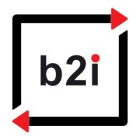
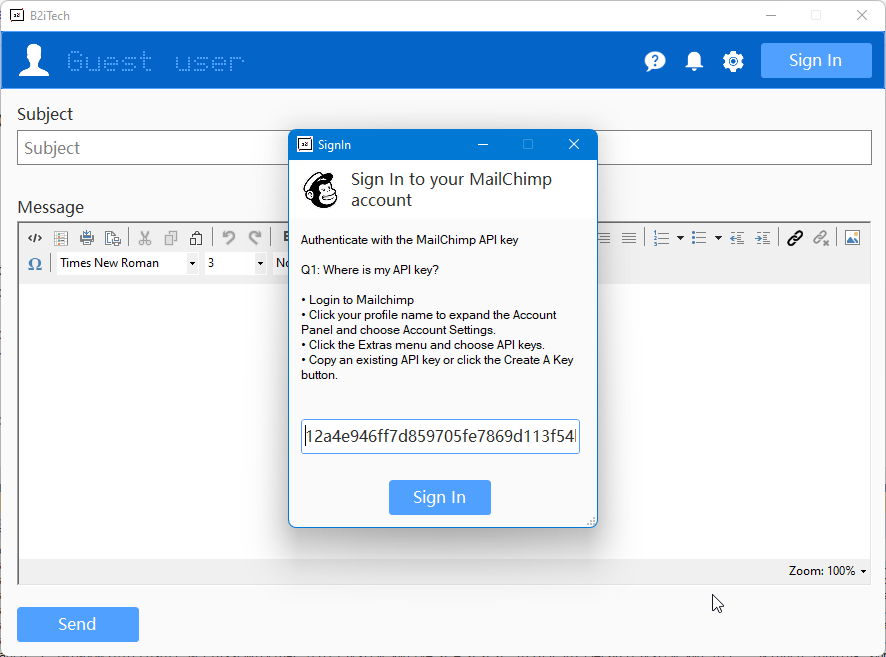
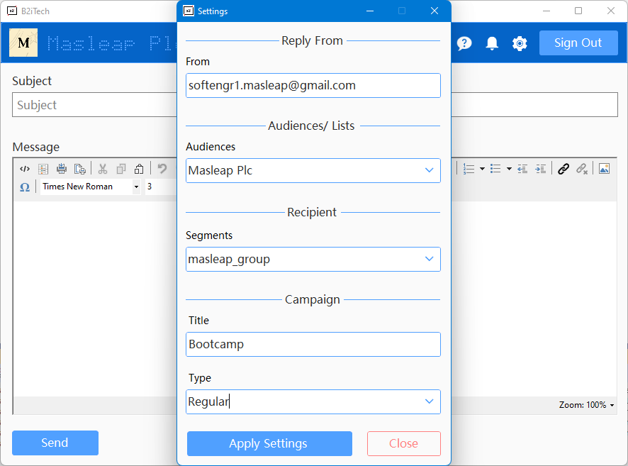
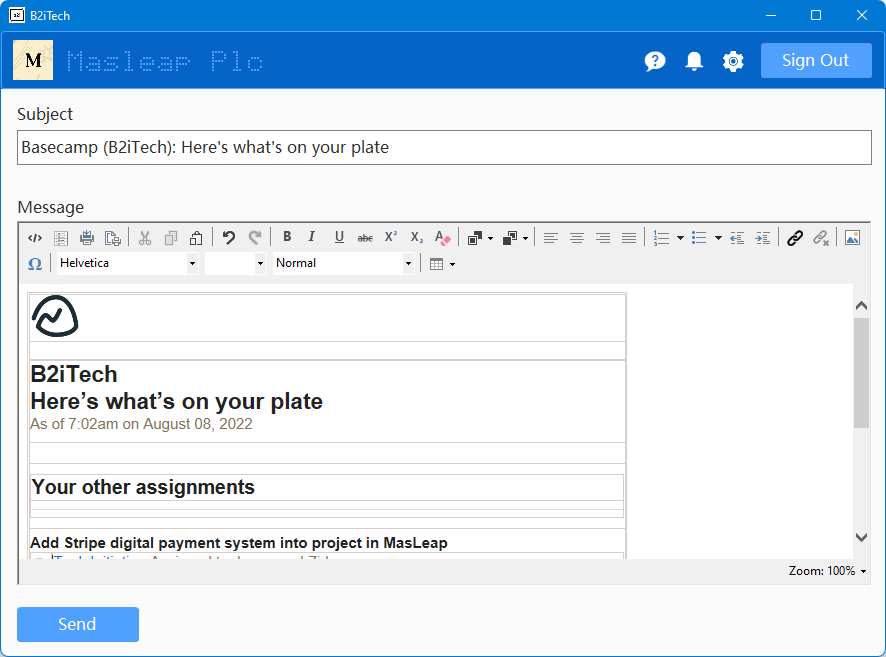

# B2iTech - HTML Mail sender

This project is created to trigger an email to be sent to a MailChimp Segment using the Mailchimp API, Visual Basic .NET 4.6 Framework. You can sign in with the API key provided by your MailChimp account.

    

## NuGet Packages Used
* <a href="https://gitee.com/yhuse/SunnyUI">SunnyUI</a>
* <a href="https://github.com/brandonseydel/MailChimp.Net">MailChimp.Net</a>
* <a href="https://zoople.tech/">HTML Editor</a>
* <a href="https://www.newtonsoft.com/json">Newtonsoft</a>

## App Screenshots

|           Sign In           |           Settings            |          Dashboard           |
|:---------------------------:|:-----------------------------:|:----------------------------:|
|  |  |  |

## What's Next?

- This is a project with basic functionality. We will extend the functionality according to future requirements.

